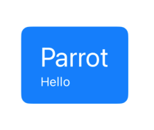
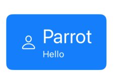
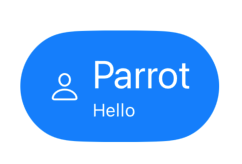
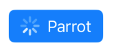

# UIButton.Configuration
On iOS 15.0, we have UIButton.Configuration struct available to configure different properties of UIButton.
It basically serves as a configuration to UIButton.
Before this configuration we had lot of difficulties for thos configuration such as adding image, subtitle, activity indicator, styling the corners, managing size of button, etc. 
Now you can see there are lots more options available with this API.

In this repository example project we will try to explore various aspects of UIButton.Configuration.

# Topics

## 1. Title and Subtitle
    Now you can easily add title and subtitle to button with
```swift
config.title = "Parrot"
config.subtitle = "Hello"
config.titleAlignment = .leading
```


## 2. Image
    Adding image is more easier than ever
```swift
config.image = UIImage(systemName: "atom")
config.imagePlacement = .trailing // where to place image
config.imagePadding = 8 // distance between image and text
config.imageColorTransformer = .... // use to tranform color
```


## 3. ButtonSize and CornerStyle
```swift
config.buttonSize = .large
config.cornerStyle = .capsule
```


## 4. Config updater
    Use this to change configuration reactively.
```swift
button.configurationUpdateHandler = { button in
    var config = button.config
    // check some condition
    if self.isSubtitleEnabled {
        config.subtitle = "Hello"
    }
    button.configuration = config
}
```
Calling `button.setNeedsUpdateConfiguration()` always invokes above handler. So, whenever you want to change button config. Just call it or create new config and assign to button.
## 5. Activity Indicator
    Now we can show to users that we are processing something after user clicked the button such as we are submitting the form.
```swift
config.showsActivityIndicator = true
```
The placement of activity indicator seems to depend on image placement.



## 6. There are lots more... 
Explore yourself. It is fun. 


## Bonus

We have created a simple interactive UI menus for viewing some of the prominent and useful configuration. Please check those out.
